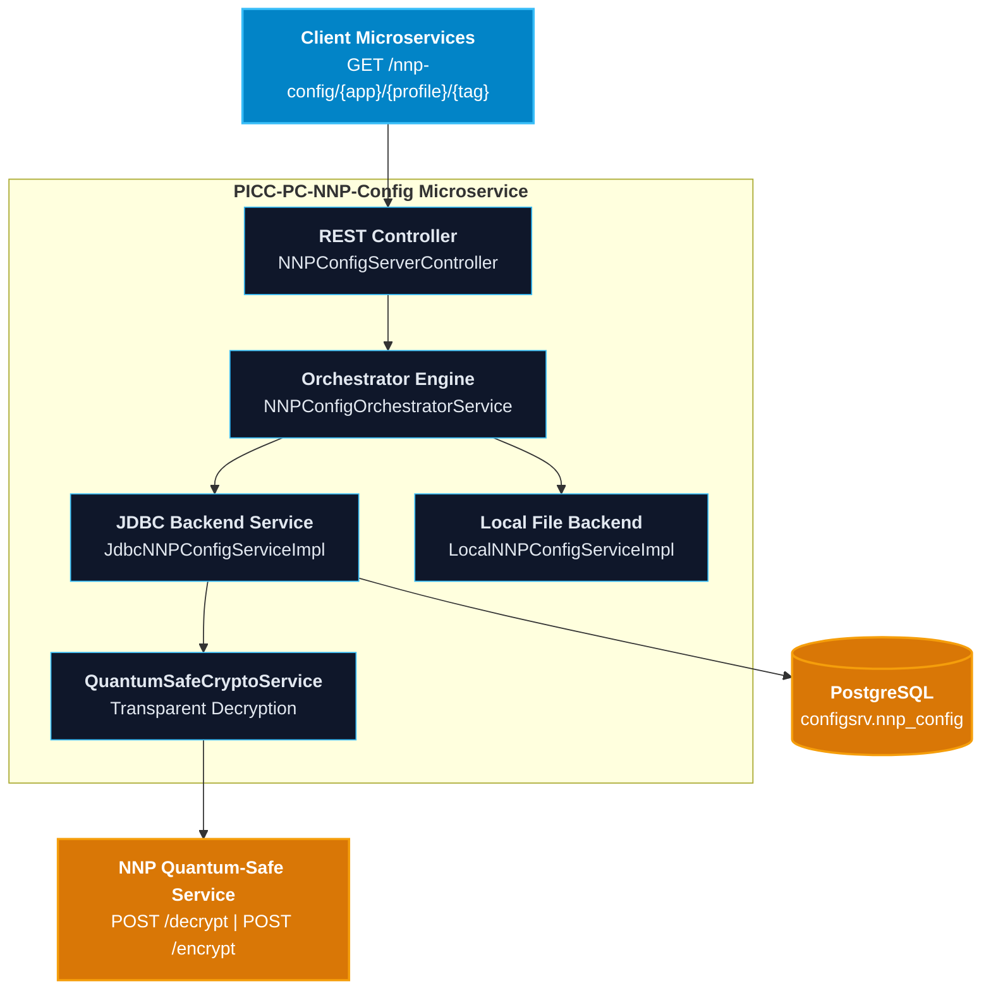

# Development Guidelines and Contribution Standards: PICC-PC-NNP-Config

This document defines the architectural standards, development workflows, coding conventions, and security requirements for contributors to **`PICC-PC-NNP-Config`**.

---

## Table of Contents

1. [Architecture and Design Principles](#1-architecture-and-design-principles)
2. [Development Environment Setup](#2-development-environment-setup)
3. [Package Structure and Code Navigation](#3-package-structure-and-code-navigation)
4. [Coding Standards and Best Practices](#4-coding-standards-and-best-practices)
   - [Constructor Injection Over Field Injection](#constructor-injection-over-field-injection)
   - [Post-Quantum Hybrid Cryptography Integration](#post-quantum-hybrid-cryptography-integration)
   - [Spring Cloud Config Server and Dual Profile Architecture](#spring-cloud-config-server-and-dual-profile-architecture)
   - [Exception Handling and Resilience](#exception-handling-and-resilience)
   - [Log Sanitization and Data Protection](#log-sanitization-and-data-protection)
5. [Security, Code Quality and Compliance Tooling](#5-security-code-quality-and-compliance-tooling)
   - [SpotBugs and FindSecBugs SAST](#spotbugs-and-findsecbugs-sast)
   - [OWASP Dependency-Check SCA](#owasp-dependency-check-sca)
   - [CycloneDX SBOM Generation](#cyclonedx-sbom-generation)
   - [Checkstyle Google Java Style](#checkstyle-google-java-style)
6. [Git Workflow and Branching Strategy](#6-git-workflow-and-branching-strategy)
   - [Branch Naming Conventions](#branch-naming-conventions)
   - [Conventional Commits](#conventional-commits)
7. [Pull Request (PR) Checklist](#7-pull-request-pr-checklist)
8. [Release Lifecycle and Versioning](#8-release-lifecycle-and-versioning)

---

## 1. Architecture and Design Principles

`PICC-PC-NNP-Config` operates as the centralized configuration authority within the **Nubo Native Platform (NNP)** ecosystem. It provides multi-tenant configuration resolution with transparent decryption of post-quantum hybrid encrypted values:



### Core Tenets:
1. **Zero-Trust At-Rest Encryption**: Plaintext configurations and hybrid ciphertexts coexist in the same table. Client applications receive decrypted properties in memory over secure channels; at rest, database records store only cryptographic envelopes.
2. **Deterministic Inheritance**: Property resolution applies default properties (`common`) across profiles and overrides with application-specific records when keys conflict.
3. **Pluggable Persistence**: The orchestrator decouples the retrieval strategy using Spring profiles (`jdbc`, `local`), allowing offline development without database dependencies.
4. **Resilient Crypto Fallback**: Invalid, corrupted, or non-JSON payloads marked as encrypted gracefully fall back with detailed warning logs without crashing the configuration resolution pipeline.

---

## 2. Development Environment Setup

### Required Tools
- **JDK 21** (Eclipse Temurin 21 recommended).
- **Maven 3.9+** (or use `./mvnw` / `mvnw.cmd`).
- **Docker and Docker Compose** (for PostgreSQL and containerized testing).
- **IDE**: IntelliJ IDEA, VS Code, or Eclipse with:
  - **Lombok Plugin** installed and *Annotation Processing* enabled.
  - **Google Java Format** plugin recommended.

### Quick Setup Verification
```bash
# Clone the repository
git clone https://github.com/Nubo-Native-Platform/PICC-PC-NNP-Config.git
cd PICC-PC-NNP-Config

# Run compilation and unit tests
./mvnw clean test

# Run static security analysis
./mvnw spotbugs:check
```

---

## 3. Package Structure and Code Navigation

```
com.nnp.common.config
├── config/              # Spring configuration beans, OpenAPI/Swagger 3.0 specification
├── constants/           # Shared constants (delimiters, suffixes, default app names)
├── controller/          # REST Controllers exposing HTTP endpoints
├── crypto/              # QuantumSafeCryptoService and request/response DTOs
├── entity/              # Jakarta Persistence entities and composite primary keys
├── exception/           # Custom runtime exception definitions
├── naming/              # Hibernate naming strategy preserving quoted table/column names
├── repo/                # Spring Data JPA repositories
├── service/
│   ├── intf/           # Service interface definitions
│   └── impl/           # Orchestrator and backend implementations (JDBC, Local)
├── to/                  # Transfer Objects (DTOs) for API payloads
└── utils/               # Utility classes (LogUtils log-injection sanitizer)
```

---

## 4. Coding Standards and Best Practices

### Constructor Injection Over Field Injection
Do **not** use `@Autowired` on private fields. Always use explicit constructor injection with `final` fields:

```java
// CORRECT
@Service
public class NNPConfigOrchestratorService {
    private final ApplicationContext appContext;

    public NNPConfigOrchestratorService(ApplicationContext appContext) {
        this.appContext = appContext;
    }
}
```

### Post-Quantum Hybrid Cryptography Integration
`QuantumSafeCryptoService` encapsulates all interactions with the external Quantum-Safe service (X25519 ECDH + NIST FIPS 203 ML-KEM-768 with AES-256-GCM):
- Validates payload structure via `isEncryptedPayload(String)` before invoking remote endpoints.
- Prevents double-encryption idempotency issues on bulk operations.
- Normalizes URL paths and enforces HTTP timeouts (5s connect, 10s read).

### Spring Cloud Config Server and Dual Profile Architecture
The service supports dual storage modes selected via `spring.profiles.active`:
- **`jdbc` profile**: Activates `JdbcNNPConfigServiceImpl` backed by PostgreSQL. Queries configuration records for `common` and the requested application, decrypts any ciphertext values on the fly, and merges overrides.
- **`local` profile**: Activates `LocalNNPConfigServiceImpl` reading from `application-local.yml` and local classpath JSON files, enabling zero-database testing and local microservice emulation.

### Exception Handling and Resilience
Throw domain-specific exceptions (`ConfigServiceException`) instead of generic `RuntimeException`. Log contextual details with sanitized parameters before re-throwing.

### Log Sanitization and Data Protection
Never log raw user input, keys, or passwords. All dynamic log arguments must be sanitized using `LogUtils.sanitizeForLog(...)` to prevent CRLF log injection:

```java
log.info("Processing configuration for application: {}", LogUtils.sanitizeForLog(application));
```

---

## 5. Security, Code Quality and Compliance Tooling

This project integrates automated security scans directly into Maven lifecycle phases and GitHub Actions CI/CD:

| Tool | Maven Command | Purpose |
|---|---|---|
| **SpotBugs and FindSecBugs** | `mvn spotbugs:check` | Static Application Security Testing (SAST) for bugs and CVE patterns. |
| **OWASP Dependency-Check** | `mvn dependency-check:check` | Software Composition Analysis (SCA) checking transitive dependencies against NVD. |
| **CycloneDX SBOM** | `mvn cyclonedx:makeAggregateBom` | Generates aggregate Software Bill of Materials in JSON format. |
| **Checkstyle** | `mvn checkstyle:check` | Enforces Google Java Style formatting rules. |

### SpotBugs and FindSecBugs SAST
Runs static analysis with the FindSecBugs security ruleset. Low-value noise is excluded via [`spotbugs-exclude.xml`](spotbugs-exclude.xml).

### OWASP Dependency-Check SCA
Monitors project dependencies against the National Vulnerability Database (NVD). Builds fail on CVSS score >= 7.

### CycloneDX SBOM Generation
Generates a complete aggregate Software Bill of Materials in standard JSON specification format for supply chain security.

### Checkstyle Google Java Style
Ensures adherence to consistent indentation, import order, and code layout following Google Java Style guidelines.

---

## 6. Git Workflow and Branching Strategy

### Branch Naming Conventions
- `feature/<issue-or-topic>`: New capabilities or functional extensions.
- `fix/<issue-or-topic>`: Defect repairs or bug fixes.
- `refactor/<topic>`: Code structural improvements without behavioral changes.
- `docs/<topic>`: Documentation updates, manuals, or diagram refinements.

### Conventional Commits
All commit messages must follow the [Conventional Commits](https://www.conventionalcommits.org/) specification:
```
<type>(<scope>): <short summary>

[optional body explaining motivation and changes]
```
*Examples:*
- `feat(crypto): add bulk re-encryption support for application records`
- `fix(controller): resolve incorrect status code on model update`
- `docs(readme): add Docker Compose quickstart instructions`

---

## 7. Pull Request (PR) Checklist

Before submitting a Pull Request, verify the following:

- [ ] All unit tests pass (`./mvnw clean test`).
- [ ] SpotBugs check passes with zero errors (`./mvnw spotbugs:check`).
- [ ] New methods and endpoints have corresponding unit tests.
- [ ] No hardcoded passwords, tokens, internal URLs, or filesystem paths exist.
- [ ] All controller endpoints are documented with OpenAPI annotations (`@Operation`).
- [ ] Logging statements sanitize dynamic variables using `LogUtils.sanitizeForLog(...)`.
- [ ] Branch is rebased onto the latest `main`.

---

## 8. Release Lifecycle and Versioning

Releases follow [Semantic Versioning (SemVer) 2.0.0](https://semver.org/):
- **MAJOR (`X.y.z`)**: Incompatible API changes, database schema breaking alterations.
- **MINOR (`x.Y.z`)**: Backward-compatible functional enhancements, new endpoints.
- **PATCH (`x.y.Z`)**: Backward-compatible bug fixes and security patches.
