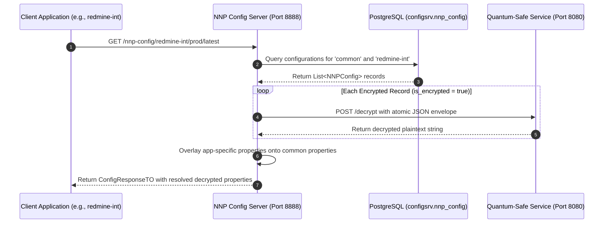

# PICC-PC-NNP-Config

[](LICENSE)
[](https://openjdk.org/projects/jdk/21/)
[](https://spring.io/projects/spring-boot)

**`PICC-PC-NNP-Config`** is the enterprise Central Configuration Service for the **Nubo Native Platform (NNP)**. It provides multi-tenant, profile-driven configuration resolution for distributed microservices with native, transparent support for **post-quantum hybrid encrypted configuration values** (combining classical **X25519** ECDH and NIST FIPS 203 **ML-KEM-768** key encapsulation with **AES-256-GCM**).

---

## Table of Contents

- [Features](#features)
- [Architecture and Post-Quantum Cryptography](#architecture-and-post-quantum-cryptography)
- [Quick Start with Docker Compose](#quick-start-with-docker-compose)
- [Database Schema and Storage Pattern](#database-schema-and-storage-pattern)
- [OpenAPI 3.0 and Swagger UI](#openapi-30-and-swagger-ui)
- [REST API Endpoints](#rest-api-endpoints)
- [Configuration Reference](#configuration-reference)
- [Build, Test and Quality Gates](#build-test-and-quality-gates)
- [Documentation and Community](#documentation-and-community)
- [License](#license)

---

## Features

- **Spring Cloud Config and JDBC Backend**: Profile-aware configuration resolution supporting multi-tier environments (`dev`, `stage`, `prod`) with application-specific overrides over baseline `common` properties.
- **Post-Quantum Hybrid Encryption**: Secrets are secured via hybrid cryptography combining classical X25519 ECDH and NIST FIPS 203 ML-KEM-768 with AES-256-GCM.
- **Transparent Decryption**: Encrypted secrets are decrypted dynamically in memory when authorized client applications query their configuration. The database retains only the encrypted ciphertext envelope.
- **Plaintext and Ciphertext Coexistence**: Seamlessly handles both plaintext and encrypted records in the same table without breaking existing applications.
- **Bulk Cryptographic Operations**: Dedicated administrative endpoints to encrypt or decrypt all configuration keys for any given application.
- **Interactive OpenAPI 3.0 and Swagger UI**: Built-in interactive documentation and testing interface.
- **Enterprise DevSecOps Ready**: Automated SpotBugs SAST, OWASP dependency checks, CycloneDX SBOM generation, and GitHub Actions CI/CD.

---

## Architecture and Post-Quantum Cryptography

`PICC-PC-NNP-Config` decouples storage from cryptographic processing, delegating encryption and decryption tasks to the external **NNP Quantum-Safe Service**:



---

## Quick Start with Docker Compose

Spin up the complete local environment (PostgreSQL 16 and `PICC-PC-NNP-Config`):

```bash
# 1. Clone repository
git clone https://github.com/Nubo-Native-Platform/PICC-PC-NNP-Config.git
cd PICC-PC-NNP-Config

# 2. Package application jar
./mvnw clean package -DskipTests

# 3. Start containers
docker-compose up -d

# 4. Verify health
curl http://localhost:8888/actuator/health
```

---

## Database Schema and Storage Pattern

Configurations are persisted in PostgreSQL table `configsrv.nnp_config`.

### Table DDL Setup
```sql
CREATE SCHEMA IF NOT EXISTS configsrv;

CREATE TABLE IF NOT EXISTS configsrv.nnp_config (
    application    VARCHAR(255) NOT NULL,
    profile        VARCHAR(255) NOT NULL,
    tag            VARCHAR(255) NOT NULL,
    key            VARCHAR(255) NOT NULL,
    value          TEXT,
    is_encrypted   BOOLEAN DEFAULT FALSE,
    created_by     VARCHAR(255),
    date_created   TIMESTAMP,
    modified_by    VARCHAR(255),
    date_modified  TIMESTAMP,
    PRIMARY KEY (application, profile, tag, key)
);
```

### Storage Pattern (Cryptographic Envelope)
- **Plaintext Records (`is_encrypted = false`)**: Raw string (e.g., `localhost`).
- **Encrypted Records (`is_encrypted = true`)**: Atomic JSON envelope containing key encapsulation and ciphertext parameters:
  ```json
  {
    "kem_ciphertext": "r7nK...base64...",
    "x25519_ephemeral_public": "9sLp...base64...",
    "nonce": "kM20...base64...",
    "ciphertext": "aZ99...base64..."
  }
  ```

---

## OpenAPI 3.0 and Swagger UI

Once the service is running, explore and test the REST API interactively:

- **Swagger UI**: [http://localhost:8888/swagger-ui.html](http://localhost:8888/swagger-ui.html)
- **OpenAPI JSON Specification**: [http://localhost:8888/api-docs](http://localhost:8888/api-docs)

---

## REST API Endpoints

### 1. Client Configuration Resolution
- **`GET /nnp-config/{application}/{profiles}/{tag}`**: Returns resolved properties for client applications. Encrypted values are decrypted transparently in memory.
  ```http
  GET /nnp-config/redmine-int/prod/latest
  ```

### 2. Configuration Management CRUD
| Method | Path | Description |
|---|---|---|
| `GET` | `/nnp-config` | List all configuration records with `is_encrypted` flag. |
| `POST` | `/nnp-config` | Create a new configuration record. Encrypts value if `is_encrypted = true`. |
| `PUT` | `/nnp-config` | Update a configuration record. Encrypts value if `is_encrypted = true`. |
| `DELETE` | `/nnp-config` | Delete a configuration record by composite primary key. |
| `POST` | `/nnp-config/bulk` | Create or update multiple configuration records in a single transaction. |

### 3. Bulk Cryptographic Operations
- **`POST /nnp-config/{application}/encrypt`**: Scans all records for `{application}`, encrypts any plaintext values, and updates `is_encrypted = true`.
- **`POST /nnp-config/{application}/decrypt`**: Scans all records for `{application}`, decrypts encrypted ciphertexts, and resets `is_encrypted = false`.

---

## Configuration Reference

Key properties configured in `application.properties` (with environment variable overrides):

| Property | Environment Variable | Default | Description |
|---|---|---|---|
| `server.port` | `SERVER_PORT` | `8888` | HTTP listening port |
| `spring.profiles.active` | `SPRING_PROFILES_ACTIVE` | `jdbc,local` | Active profiles (`jdbc`, `local`) |
| `db.user` | `DB_USER` | `postgres` | Database username |
| `db.password` | `DB_PASSWORD` | `postgres` | Database password |
| `db.url` | `DB_URL` | `jdbc:postgresql://localhost:5432/nnp-core-comp` | JDBC connection string |
| `quantum.safe.service.url` | `QUANTUM_SAFE_SERVICE_URL` | `http://localhost:8080` | External Quantum-Safe service URL |
| `logging.level.root` | `LOGGING_LEVEL` | `INFO` | Root logging level |

---

## Build, Test and Quality Gates

### Run Unit Tests
```bash
./mvnw clean test
```

### Static Application Security Testing (SpotBugs and FindSecBugs)
```bash
./mvnw spotbugs:check
```

### Dependency Vulnerability Scanning (OWASP)
```bash
./mvnw dependency-check:check
```

### Generate CycloneDX SBOM
```bash
./mvnw cyclonedx:makeAggregateBom
```

---

## Documentation and Community

- [User Manual and Deployment Guide](USER_MANUAL_AND_DEPLOYMENT_GUIDE.md)
- [Development Guidelines](DEVELOPMENT_GUIDELINES.md)
- [Contributing Guide](CONTRIBUTING.md)
- [Code of Conduct](CODE_OF_CONDUCT.md)
- [Security Policy](SECURITY.md)
- [Maintainers](MAINTAINERS.md)

Contact: **contribution@nubons.com**

---

## License

Licensed under the **Apache License 2.0** — see [LICENSE](LICENSE).
