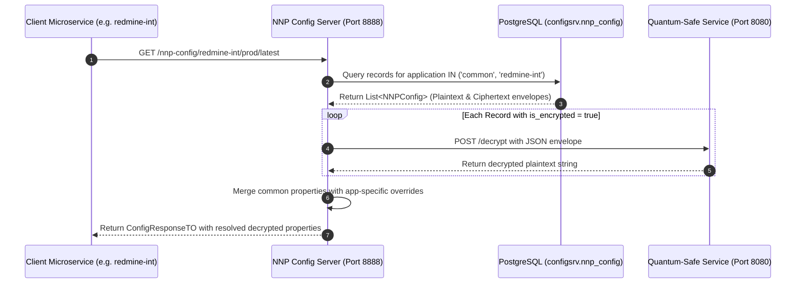

# User Manual and Deployment Guide: PICC-PC-NNP-Config

This document provides a comprehensive operational and deployment guide for the **`PICC-PC-NNP-Config`** microservice within the **Nubo Native Platform (NNP)**. It covers architecture, database schema, post-quantum encryption workflows, API endpoint references, containerization, and production deployment on Kubernetes.

---

## Table of Contents

1. [Service Architecture and Role](#1-service-architecture-and-role)
2. [Prerequisites and System Requirements](#2-prerequisites-and-system-requirements)
3. [Configuration Reference and Profiles](#3-configuration-reference-and-profiles)
   - [Environment Variables Matrix](#environment-variables-matrix)
   - [Supported Profiles](#supported-profiles)
4. [Database Schema and Cryptographic Storage](#4-database-schema-and-cryptographic-storage)
   - [PostgreSQL Table Structure](#postgresql-table-structure)
   - [Cryptographic Envelope Format](#cryptographic-envelope-format)
5. [REST API Endpoints Reference](#5-rest-api-endpoints-reference)
   - [Configuration Resolution for Client Applications](#configuration-resolution-for-client-applications)
   - [CRUD and Bulk Operations](#crud-and-bulk-operations)
   - [Application Bulk Encryption and Decryption](#application-bulk-encryption-and-decryption)
   - [Domain Values and AI Model Details](#domain-values-and-ai-model-details)
6. [Local Build and Containerization](#6-local-build-and-containerization)
   - [Local Build with Maven](#local-build-with-maven)
   - [Docker Container Build and Execution](#docker-container-build-and-execution)
   - [Docker Compose Quickstart](#docker-compose-quickstart)
7. [Production Deployment on Kubernetes](#7-production-deployment-on-kubernetes)
   - [Kubernetes Deployment and Service Manifest](#kubernetes-deployment-and-service-manifest)
   - [Kubernetes Configuration Keys and Replacement Placeholders](#kubernetes-configuration-keys-and-replacement-placeholders)
   - [Liveness and Readiness Probes](#liveness-and-readiness-probes)
8. [Troubleshooting and Frequently Asked Questions](#8-troubleshooting-and-frequently-asked-questions)

---

## 1. Service Architecture and Role

`PICC-PC-NNP-Config` serves as the centralized configuration management authority for all microservices in the Nubo Native Platform. Built on top of Spring Cloud Config Server and Spring Boot 3 / Java 21, it resolves hierarchical configurations, seamlessly overlays application-specific overrides onto common configurations, and dynamically decrypts post-quantum hybrid encrypted values.



---

## 2. Prerequisites and System Requirements

| Component | Minimum Version | Recommended Version |
|---|---|---|
| **Java Runtime (JRE)** | OpenJDK 21 LTS | Eclipse Temurin 21 |
| **PostgreSQL Database** | PostgreSQL 13 | PostgreSQL 16+ |
| **NNP Quantum-Safe Service** | 1.0.0 | Latest release |
| **RAM** | 512 MB | 1024 MB |
| **CPU** | 0.5 vCPU | 1.0 vCPU |

---

## 3. Configuration Reference and Profiles

### Environment Variables Matrix

| Variable | Default Value | Description |
|---|---|---|
| `SERVER_PORT` | `8888` | Port on which the Spring Boot microservice listens. |
| `SPRING_PROFILES_ACTIVE` | `jdbc,local` | Active profiles (comma-separated: `jdbc`, `local`). |
| `DB_HOST` | `localhost` | PostgreSQL database host. |
| `DB_PORT` | `5432` | PostgreSQL database port. |
| `DB_NAME` | `nnp-core-comp` | PostgreSQL database name. |
| `DB_USER` | `postgres` | Database username. |
| `DB_PASSWORD` | `postgres` | Database password. |
| `DB_URL` | `jdbc:postgresql://${DB_HOST}:${DB_PORT}/${DB_NAME}` | Full JDBC connection string. |
| `HIKARI_MAX_POOL_SIZE`| `20` | Maximum connections in HikariCP pool. |
| `HIKARI_MIN_IDLE` | `10` | Minimum idle connections in pool. |
| `QUANTUM_SAFE_SERVICE_URL`| `http://localhost:8080` | Endpoint for the Quantum-Safe Service. |
| `LOGGING_LEVEL` | `INFO` | Root log level (`DEBUG`, `INFO`, `WARN`, `ERROR`). |

### Supported Profiles
- **`jdbc`**: Connects to PostgreSQL and loads configurations from table `configsrv.nnp_config`. Supports dynamic encryption and decryption.
- **`local`**: Reads configurations from `classpath:application-local.yml` and local JSON files. Useful for isolated, offline local development.

---

## 4. Database Schema and Cryptographic Storage

### PostgreSQL Table Structure

Configurations are stored in PostgreSQL under schema `configsrv`:

```sql
CREATE SCHEMA IF NOT EXISTS configsrv;

CREATE TABLE IF NOT EXISTS configsrv.nnp_config (
    application    VARCHAR(255) NOT NULL,
    profile        VARCHAR(255) NOT NULL,
    tag            VARCHAR(255) NOT NULL,
    key            VARCHAR(255) NOT NULL,
    value          TEXT,
    is_encrypted   BOOLEAN DEFAULT FALSE,
    created_by     VARCHAR(255),
    date_created   TIMESTAMP,
    modified_by    VARCHAR(255),
    date_modified  TIMESTAMP,
    PRIMARY KEY (application, profile, tag, key)
);
```

### Cryptographic Envelope Format
When `is_encrypted = true`, the `value` column contains an atomic JSON string containing the hybrid cryptographic envelope:

```json
{
  "kem_ciphertext": "r7nK...base64...",
  "x25519_ephemeral_public": "9sLp...base64...",
  "nonce": "kM20...base64...",
  "ciphertext": "aZ99...base64..."
}
```

---

## 5. REST API Endpoints Reference

Interactive documentation is available at `/swagger-ui.html` once the service is running.

### Configuration Resolution for Client Applications
- **Path**: `GET /nnp-config/{application}/{profiles}/{tag}`
- **Headers**: `Accept: application/vnd.spring-cloud.config-server.v2+json`
- **Description**: Returns resolved configuration key-values. Encrypted values are automatically decrypted.

### CRUD and Bulk Operations
- **`GET /nnp-config`**: List all configuration records with `is_encrypted` flag.
- **`POST /nnp-config`**: Create a single configuration record.
- **`PUT /nnp-config`**: Update an existing configuration record.
- **`DELETE /nnp-config`**: Delete configuration by primary key.
- **`POST /nnp-config/bulk`**: Create or update multiple configuration records in a single transactional request.

### Application Bulk Encryption and Decryption
- **`POST /nnp-config/{application}/encrypt`** *(alias: `/nnp-config/encrypt/{application}`)*:
  Scans all properties for `{application}`, encrypts any plaintext records, and updates `is_encrypted = true`.
- **`POST /nnp-config/{application}/decrypt`** *(alias: `/nnp-config/decrypt/{application}`)*:
  Scans all properties for `{application}`, decrypts encrypted records, and sets `is_encrypted = false`.

### Domain Values and AI Model Details
- **`GET /domain/all`**: Get all registered domain values.
- **`GET /domain/all/domval/{appName}`**: Get all domain values mapped to a specific UI application.
- **`GET /nnp-config/api/v1/model-details`**: Retrieve AI model configurations.

---

## 6. Local Build and Containerization

### Local Build with Maven
```bash
# Build executable jar
./mvnw clean package -DskipTests
```

### Docker Container Build and Execution
```bash
# Build local container image
docker build -t picc-pc-nnp-config:latest .

# Run container
docker run -d \
  --name nnp-config \
  -p 8888:8888 \
  -e DB_HOST=host.docker.internal \
  -e DB_USER=postgres \
  -e DB_PASSWORD=postgres \
  picc-pc-nnp-config:latest
```

### Docker Compose Quickstart
Start the full stack (PostgreSQL database and NNP Config server):
```bash
docker-compose up -d
```
Verify running status:
```bash
docker-compose ps
curl http://localhost:8888/actuator/health
```

---

## 7. Production Deployment on Kubernetes

### Kubernetes Deployment and Service Manifest

The following template uses explicit placeholder keys (`<PLACEHOLDER>`) for deployment customization:

```yaml
apiVersion: apps/v1
kind: Deployment
metadata:
  name: picc-pc-nnp-config
  namespace: <K8S_NAMESPACE>
  labels:
    app.kubernetes.io/name: picc-pc-nnp-config
spec:
  replicas: <REPLICA_COUNT>
  selector:
    matchLabels:
      app.kubernetes.io/name: picc-pc-nnp-config
  template:
    metadata:
      labels:
        app.kubernetes.io/name: picc-pc-nnp-config
    spec:
      containers:
        - name: nnp-config
          image: <CONTAINER_REGISTRY>/<IMAGE_NAME>:<IMAGE_TAG>
          imagePullPolicy: IfNotPresent
          ports:
            - containerPort: 8888
              name: http
          env:
            - name: SERVER_PORT
              value: "<SERVER_PORT>"
            - name: SPRING_PROFILES_ACTIVE
              value: "<SPRING_PROFILES_ACTIVE>"
            - name: DB_HOST
              value: "<POSTGRES_SERVICE_HOST>"
            - name: DB_PORT
              value: "<POSTGRES_SERVICE_PORT>"
            - name: DB_NAME
              value: "<POSTGRES_DATABASE_NAME>"
            - name: DB_USER
              valueFrom:
                secretKeyRef:
                  name: <DB_CREDENTIALS_SECRET_NAME>
                  key: <DB_USERNAME_SECRET_KEY>
            - name: DB_PASSWORD
              valueFrom:
                secretKeyRef:
                  name: <DB_CREDENTIALS_SECRET_NAME>
                  key: <DB_PASSWORD_SECRET_KEY>
            - name: QUANTUM_SAFE_SERVICE_URL
              value: "<QUANTUM_SAFE_SERVICE_URL>"
          resources:
            requests:
              cpu: <CPU_REQUEST>
              memory: <MEMORY_REQUEST>
            limits:
              cpu: <CPU_LIMIT>
              memory: <MEMORY_LIMIT>
          livenessProbe:
            httpGet:
              path: /actuator/health/liveness
              port: 8888
            initialDelaySeconds: 30
            periodSeconds: 15
          readinessProbe:
            httpGet:
              path: /actuator/health/readiness
              port: 8888
            initialDelaySeconds: 20
            periodSeconds: 10
---
apiVersion: v1
kind: Service
metadata:
  name: picc-pc-nnp-config
  namespace: <K8S_NAMESPACE>
spec:
  type: ClusterIP
  ports:
    - port: 8888
      targetPort: 8888
      name: http
  selector:
    app.kubernetes.io/name: picc-pc-nnp-config
```

### Kubernetes Configuration Keys and Replacement Placeholders

| Placeholder Key | Example / Default | Description |
|---|---|---|
| `<K8S_NAMESPACE>` | `nnp-core-components` | Target Kubernetes namespace. |
| `<REPLICA_COUNT>` | `2` | Number of pod replicas. |
| `<CONTAINER_REGISTRY>` | `ghcr.io/nubo-native-platform` | Container registry host and organization. |
| `<IMAGE_NAME>` | `picc-pc-nnp-config` | Application container image name. |
| `<IMAGE_TAG>` | `1.0.0` | Container image release tag. |
| `<SERVER_PORT>` | `8888` | Internal microservice port. |
| `<SPRING_PROFILES_ACTIVE>` | `jdbc` | Active profiles (`jdbc` or `jdbc,local`). |
| `<POSTGRES_SERVICE_HOST>` | `postgresql.<namespace>.svc.cluster.local` | Cluster-internal PostgreSQL service DNS or host. |
| `<POSTGRES_SERVICE_PORT>` | `5432` | PostgreSQL service port. |
| `<POSTGRES_DATABASE_NAME>`| `nnp-core-comp` | Target database name. |
| `<DB_CREDENTIALS_SECRET_NAME>` | `nnp-db-credentials` | Kubernetes Secret containing database credentials. |
| `<DB_USERNAME_SECRET_KEY>` | `username` | Key in secret containing DB username. |
| `<DB_PASSWORD_SECRET_KEY>` | `password` | Key in secret containing DB password. |
| `<QUANTUM_SAFE_SERVICE_URL>` | `http://quantum-safe-service.<namespace>.svc.cluster.local:8080` | Cluster-internal URL for Quantum-Safe service. |
| `<CPU_REQUEST>` / `<CPU_LIMIT>` | `100m` / `500m` | CPU allocation limits. |
| `<MEMORY_REQUEST>` / `<MEMORY_LIMIT>` | `256Mi` / `1024Mi` | Memory allocation limits. |

### Liveness and Readiness Probes
The service leverages Spring Boot Actuator health endpoints:
- **Liveness probe**: Evaluates whether the application context is alive via `/actuator/health/liveness`.
- **Readiness probe**: Evaluates whether downstream components (database and internal dependencies) are ready to accept traffic via `/actuator/health/readiness`.

---

## 8. Troubleshooting and Frequently Asked Questions

### Problem: `BadSqlGrammarException: relation "properties" does not exist`
**Cause**: Spring Cloud Config Server's built-in JDBC repository looks for a table named `PROPERTIES` by default.  
**Resolution**: The application uses its own `JdbcNNPConfigServiceImpl`. Ensure `spring.cloud.config.server.jdbc.enabled=false` is set in `application-jdbc.properties`.

### Problem: Connection to Quantum-Safe service refused
**Cause**: `QUANTUM_SAFE_SERVICE_URL` is pointing to an unreachable host or the service is starting up.  
**Resolution**: Check network connectivity to the quantum-safe service. If unencrypted values are requested, the service will still resolve them; only encrypted values require the external crypto service.
